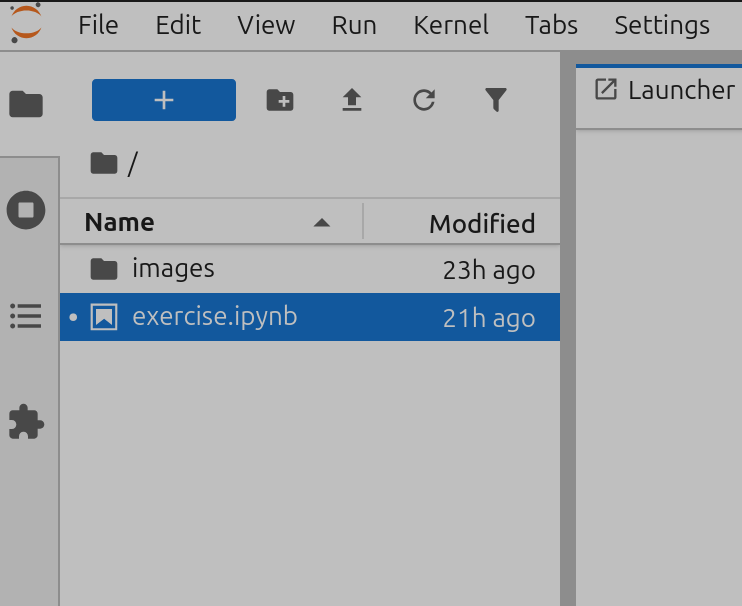

# ml-exercise

This repository shows how to set up a simple machine learning exercise in a Jupyter Notebook. The exercise asks the student to implement the ReLU function, which is commonly used as an activation function in neural networks.

For ease of use you can start the notebook using a Docker container, either through Docker Compose or using the commands presented below.

Once you start the compainer, navigate to [http://localhost:8889/lab?token=mlexercise](http://localhost:8889/lab?token=mlexercise) to execute the notebook, it will be listed on the right hand panel where you can double-click on it to open it. It looks like this:

<p align="center"></p>


## Using Docker Compose

This is the recommended way to start the container, as it is by far the easiest. Just open a terminal and navigate to the root of this repository (where this file lives) and execute the following command:

```
docker compose up
```
Depending on your setup, you might need to execute the command with administrator privileges. If that is the case and you are in a Linux or any other Unix-like OS, you will need to execute this instead:

```
sudo docker compose up
```
In either case, you need to wait until the container is ready. The first time you build the image, it can take some minutes. Once started, you can navigate to [http://localhost:8889/lab?token=mlexercise](http://localhost:8889/lab?token=mlexercise). When you are done, you can return to the terminal window and use Ctrl+C (Command+C in Apple computers) to stop the container.

Note: if you update the repository and don't see the changes after executing the previous command, execute the following command and try again:

```
sudo docker compose build
```

## Running with plain Docker

If you don't have Docker Compose or prefer not to use it, you can execute the following commands from the root of the repository.

First, build the image for the container using this command:

```
sudo docker build -t jupyter-exercise .
```

Next, start the container using this line:

```
sudo docker run --rm -p 8889:8888 jupyter-exercise start-notebook.py --NotebookApp.token='mlexercise'
```
Once the container has started, you can navigate to [http://localhost:8889/lab?token=mlexercise](http://localhost:8889/lab?token=mlexercise) and access the notebook.

## Running in an existing Jupyter environment

If you want to open the notebook in an existing Jupyter environment, make sure to uncomment the code that installs the pytest and ipytest dependencies. They are installed for you in the container image and are needed for the correct execution of the notebook. To do this, look for this line and remove the # sign at the start:

```
# %pip install pytest ipytest
```
